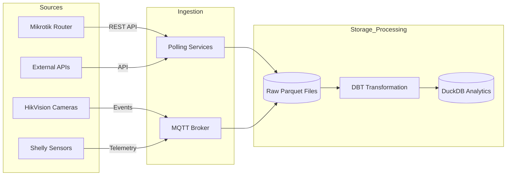
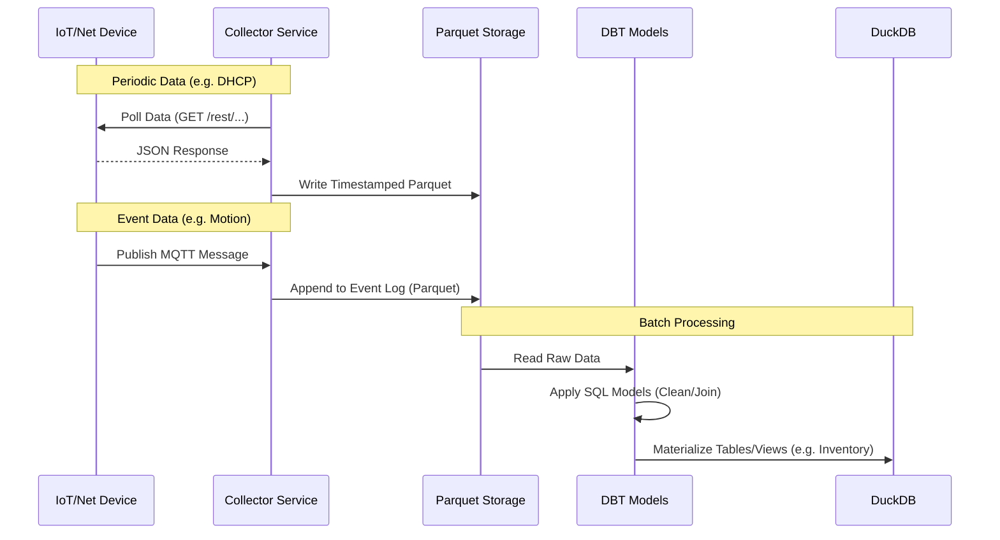

# IoT Home Automation & Analytics Platform

A comprehensive system for monitoring, managing, and analyzing a smart home/office network. This project integrates network infrastructure data (Mikrotik), IoT device telemetry (Shelly), and security feeds (HikVision) into a unified data pipeline for analytics and automation.

## Project Structure

```text
/home/gnet/iot/
├───.dockerignore          # Files excluded from Docker builds
├───.env                   # Local secrets (ignored by git)
├───.env_example           # Template for environment variables
├───.gitignore             # Git ignore rules
├───dbt_project.yml        # DBT project configuration
├───profiles.yml           # DBT connection profiles
├───debug_db.py            # Utility script for debugging DuckDB
├───homebot/               # Main Application Source Code
│   ├───app.py             # Flask API & Data Ingestion Logic
│   ├───requirements.txt   # Python dependencies
│   ├───models/            # DBT SQL Models (Data Transformations)
│   │   ├───int_shelly_metrics.sql
│   │   ├───inventory.sql
│   │   └───sources.yml
│   ├───seeds/             # Static CSV Data (e.g., Device Metadata)
│   │   └───device_metadata.csv
│   └───services/          # Integration Modules
│       └───mikrotik.py    # Mikrotik API Client
├───data/                  # Local storage for Parquet files and DuckDB
└───doc/                   # Additional Documentation
    └───development_workflow.md # Detailed workflow, integration, and step-by-step guides
```

## Environment Variables and Setup

Before running, you must configure the required environment variables by copying the example file.

1.  **Copy Configuration Template:**
    ```bash
    cp .env_example .env
    ```
2.  **Edit `.env`:** Populate with operational credentials. Required variables include:
    *   `MIKROTIK_HOST`, `MIKROTIK_USER`, `MIKROTIK_PASSWORD`
    *   `TELEGRAM_BOT_TOKEN`
    *   `SHELLEY_API_BASE_URL` (If polling directly)
    *   Database configuration (e.g., `DUCKDB_PATH`)

## How to Run Instructions

### Option 1: Python (Local Development)

1.  **Create and activate a virtual environment:**
    ```bash
    python3 -m venv venv
    source venv/bin/activate
    ```
2.  **Install dependencies:**
    ```bash
    pip install -r homebot/requirements.txt
    ```
3.  **Run the application:**
    ```bash
    python homebot/app.py
    ```
    The API will be available at `http://localhost:5000`.

### Option 2: Docker Compose

1.  **Build and run with Docker Compose:**
    ```bash
    docker-compose up -d --build
    ```
2.  **View logs:**
    ```bash
    docker-compose logs -f
    ```
3.  **Stop the service:**
    ```bash
    docker-compose down
    ```

## Data Processing & Analytics Pipeline

We employ a hybrid data collection strategy to handle the diverse nature of our IoT and network devices, ensuring both historical depth and real-time responsiveness.

### Data Collection Strategy

The system distinguishes between data that needs to be actively polled and real-time events pushed by devices.

*   **Periodic Polling (Pull):** Used for stateful information and devices without push capabilities.
    *   *Example:* Polling Mikrotik for active DHCP leases to maintain a device inventory.
*   **Event-Driven (Push):** Used for real-time telemetry and alerts.
    *   *Example:* MQTT messages from Shelly sensors (power, temperature) or HikVision camera motion alerts.

### Architecture Diagrams

#### High-Level Data Flow



#### Detailed Processing Logic



## Project REST API Calls

The primary API layer is served via Flask in [`homebot/app.py`](homebot/app.py). All endpoints require an appropriate authorization token (managed via the bot interface or environment).

**Key Endpoints:**

*   `GET /api/v1/inventory`: Retrieves the current device inventory populated from Mikrotik data and enriched with metadata.
*   `GET /api/v1/metrics/{device_id}`: Fetches the latest time-series telemetry data for a specific IoT device (Shelly).
*   `POST /api/v1/command/{device_id}`: Sends an atomic command to a managed device (e.g., toggle a relay, reboot a device). *Note: Physical actions require Telegram confirmation.*
*   `GET /api/v1/status/network`: Returns aggregated network health metrics pulled from the Mikrotik API wrapper.

## TelegramBot Integration

The user interaction layer is handled by an `aiogram` bot, utilizing inline keyboards for command execution and state management.

*   **Core Logic:** Handlers are located in [`homebot/bot/handlers/`](homebot/bot/handlers/).
*   **State Management:** The bot maintains user sessions and command contexts.
*   **Action Confirmation:** Critical hardware control actions (e.g., door locks, high-current relays) **MUST** implement a confirmation step via inline keyboard replies before executing the corresponding API call to prevent accidental changes. This logic resides primarily in handlers like [`homebot/bot/handlers/security.py`](homebot/bot/handlers/security.py).
*   **Configuration:** The bot token is loaded from the `TELEGRAM_BOT_TOKEN` environment variable.